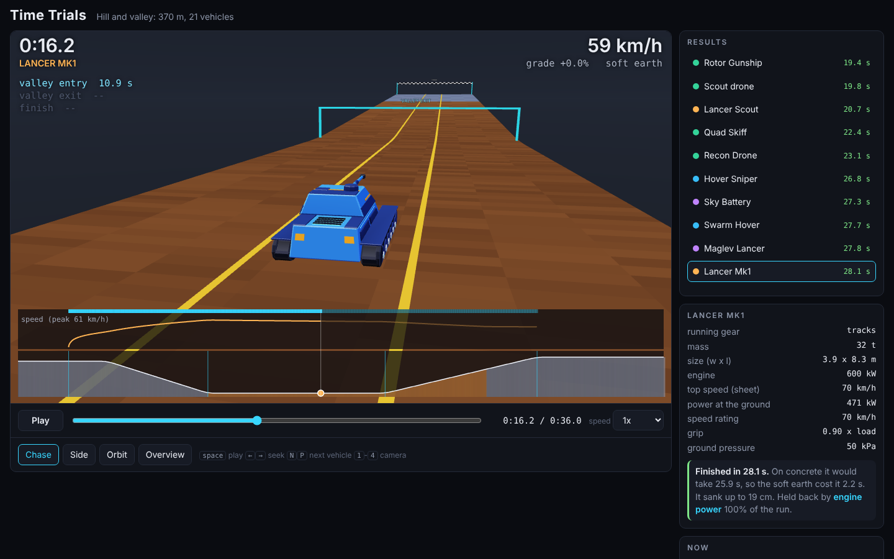
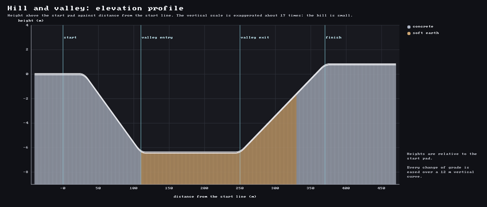
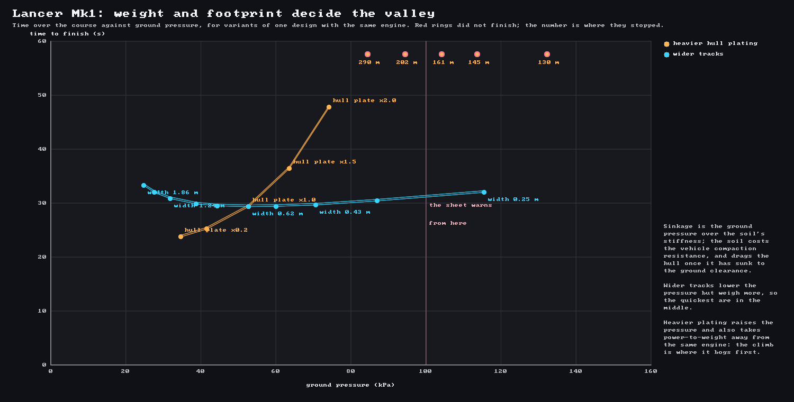
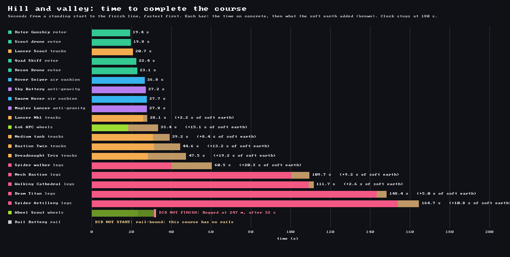
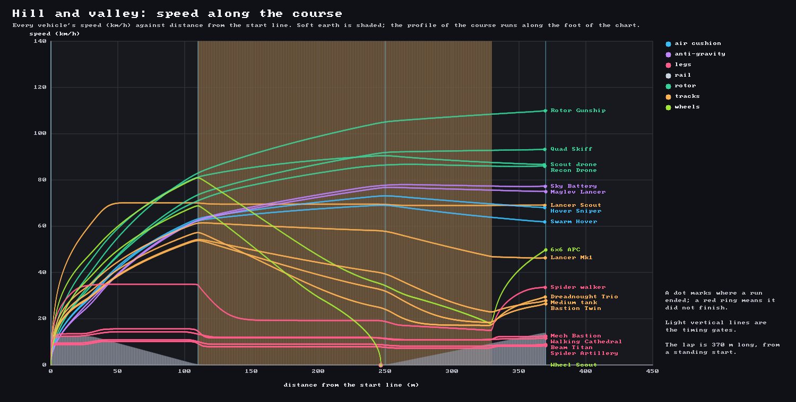
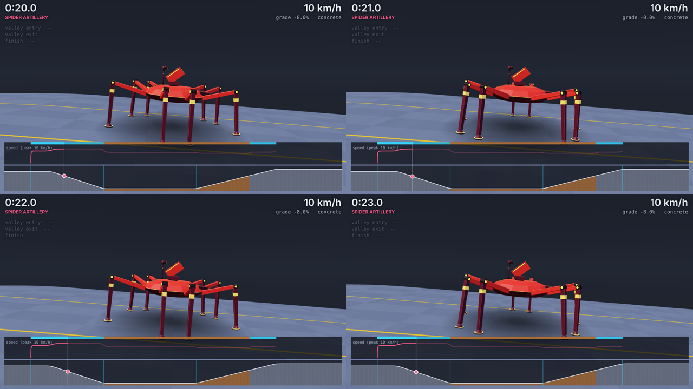

# Time Trials

*Status: built (2026-10-08). Tools: `w5k trial`, `w5k soil`; the viewer is `tools/trial/`. Everything below comes from
`crates/w5k_sim` (the simulation), `crates/w5k_forge/src/{mover,sheet,export}.rs` (turning a design into the numbers it runs on)
and `crates/w5k_tools/src/{trial_cmd,soil_cmd,trial_plots}.rs`. The ideas behind it are explained in
[the theory note](../notes/m1c-the-physics-of-a-time-trial.md); the decision is [D11](../planning/decisions.md).*

Until this milestone every number about a vehicle was a *sheet*: a closed-form estimate of what it could do on flat hard ground.
Nothing moved. A time trial puts **one vehicle on one course and asks: does this design finish, how fast, and if not, why?**
There is no combat and no second vehicle yet. It is the first slice of deterministic movement (M3) and of soft ground (M5), built
ahead of the Godot bridge so that the physics, the terrain and the design choices can be seen working together before anything
else is built on them.

> **The rule that shapes everything: every outcome is explainable.** Each tick the simulation records what *limited* the vehicle
> (engine power, grip, the speed rating, soft ground, a stall), and a run that ends early says why, with numbers and with the lever
> to pull ("it needs more engine power"; "a longer or wider footprint would push harder and sink less"). Failing to finish is an
> expected, informative result of a design choice, not an error.



## The course
`content/courses/hill_valley.ron`, with its soils in `content/terrain.ron`. Distances are from the start line (the pad also extends
40 m behind it, so long vehicles start fully on the course). Every change of grade is eased over a 12 m vertical curve (the slope
changes linearly, so the height is a parabola there).

| Segment | Length | Grade | Surface |
|---|---|---|---|
| Start pad | 30 m | flat | concrete |
| Descent | 80 m | -8 % | concrete |
| Valley | 140 m | flat | **soft earth** |
| Climb | 80 m, then 40 m | +6 % | soft earth, then concrete |
| Finish line at 370 m, then a 100 m run-out | | | |

Timing gates at 0, 110, 250 and 370 m; time limit 180 s. One lane. The terrain is a profile extruded across the lane; the movement
code only ever asks for the height and the surface at a distance `s`, so a 2D heightfield can replace it later without touching it.



**Outcomes.** `Finished(time, splits)`; `DNF(cause, distance, numbers)` where the cause is *Bogged* (stopped on soft ground),
*Stalled* (stopped anywhere else: not enough engine or grip for the slope) or *Timed out*; `DNS(reason)` when the design cannot run
the course at all (invalid design, no running gear, rail-bound: the course has no rails, or no footprint data on a course with soft
ground). "Stopped" means a speed under 0.15 m/s with nothing left to push, for three seconds.

## From a design to a run
```
design (family sliders)  ->  forge: assemble, sheet, Gear summary  ->  MoverSpec (f64, serde, deny_unknown_fields)
                                                                          |
   course.ron + terrain.ron -> Course::bake_with (Fx tables)  ----------> w5k_sim::trial::run   (fixed point, 20 Hz x 3 sub-steps)
                                                                          |
                                                          Run: 20-byte frames per tick + a state hash every second
                                                                          |
                                       browser page / MP4 (tools/trial)    results.png, traces.png     Godot player (later)
```
* **`MoverSpec`** (`w5k_sim::spec`) is everything the physics needs to know about a vehicle: mass, the power that reaches the
  ground, the rated speed, rolling resistance, grip or thrust, drag area, the support span, and the *footprint* (units, width,
  length, area, stride, hull clearance). The forge bakes it from the **same** running-gear summary (`sheet::Gear`) that gives the
  sheet its top speed, so the two cannot disagree about one vehicle: a test runs every design on a long flat road and requires the
  simulated top speed to be within 5 % of the sheet's (most are within 1 %).
* **Fixed point.** Floats enter the simulation only when a spec or a course is loaded (`Fx::from_f64` is exact IEEE arithmetic).
  After that everything is Q32.32 integers in a coherent unit system: **tonnes, kilonewtons, kilowatts, metres, seconds** (1 kN / 1 t
  = 1 m/s^2; 1 kN x 1 m/s = 1 kW), so no conversion factor appears and nothing approaches the range limit of Q32.32. No `pow`,
  `exp` or `ln` is used anywhere in a run (see [the determinism rules](02-determinism-rules.md)).
* **The replay is the interface** between the simulation and every viewer. A frame is 20 bytes of integers: distance and height
  (mm), pitch (mrad), speed (cm/s), sinkage (mm), slip (%), the limiting factor and run state, and the thrust applied, the most the
  ground allows, the slope's pull and every other resistance as a percentage of weight. A three-minute run is about 70 KB. A state
  hash is chained every second and at the end, so replaying a recorded run on another machine either reproduces every hash or has
  desynchronised, and says where.

## The physics, version 1
Along the course a vehicle obeys Newton's second law (`crates/w5k_sim/src/mover.rs`):

```
m a  =  F_thrust  -  F_slope  -  F_rolling  -  F_air  -  F_compaction  -  F_hull          (kN, with m in tonnes)
```

| Term | Law |
|---|---|
| Slope felt | `(h(s + L/2) - h(s - L/2)) / L` over the support span `L`: the ground *box-filtered* over the vehicle's length. `N = W cos(theta)`, `F_slope = W sin(theta)` |
| Engine force | `(P g(v) - c_int N v) / max(v, v_floor)`: power over speed, a hyperbola, with a lowest gear (`v_floor` = 0.2 of the rated speed: a 5:1 gearbox) in place of the infinite force at a standstill |
| Governor | `g(v) = 1 - (v / v_rated)^32`, by five squarings: power until near the rating, then a smooth cut-off, not a wall |
| Ground cap | `(1 - f) mu N + f H` for gear that grips (`H` is the soil's shear limit); `thrust_w x W` for fans, rotors and anti-gravity pods |
| Thrust | the engine force clamped to `[-cap, cap]` (only a gait's cost of transport can drive it negative) |
| Rolling | `c_roll N` (a cushion's skirt: `c_roll N v / v_rated`) |
| Air | `1/2 rho C_d A v^2` with `C_d A` = 0.9 x frontal area |

The speed is clamped to `[0, v_rated]` and progress along the (horizontal) course is `v cos(theta) dt`, in three 60 Hz sub-steps per
20 Hz tick. What each kind of running gear is in the model (`crates/w5k_forge/src/mover.rs`):

| Gear | Pushes against the ground with | Pays for |
|---|---|---|
| Tracks, wheels | grip x load (the family's traction coefficient); on soft ground the soil's shear strength | rolling resistance x load; on soft ground compaction and hull drag |
| Legs | grip x load (0.8); **the cost of transport (0.6 weight x speed of power) comes out of the engine's power first**, and a walker is not a free-rolling cart: gravity does not speed it up past what its power allows | feet pressed into soft ground once per stride |
| Air cushion | fans: 0.12 of the weight | a skirt that drags harder the faster it goes (0.03 W at the rated speed) |
| Anti-gravity, rotor | thrust 0.5 W and 0.3 W; off the ground, so the soil does not exist for them | the path is the ground smoothed over twice the altitude, so a climb costs `W sin(theta)` |
| Rail | n/a | the vehicle does not start: this course has no rails |

The power that reaches the ground is the engine's, less what other systems draw and what lift costs, times the efficiency of the
drive (wheels 0.9, tracks 0.8, legs 0.6, cushion and anti-gravity 0.7, rotor 0.5): the sheet's own arithmetic.

## Soft earth
`crates/w5k_sim/src/soil.rs`. Two classic laws of terramechanics in their simplest forms, with the exponent of Bekker's law set to 1
so that nothing needs a power function:

* **Sinkage (Bekker):** `p = (k_c / b + k_phi) z`, so `z = p / k` for a ground pressure `p = N / A` on footprints of width `b`. The soil
  beside a narrow footprint helps carry it, so narrow footprints sink *less* at the same pressure.
* **Thrust (Mohr-Coulomb):** soil shears at `c + p tan(phi)`, so a footprint of area `A` carrying `N` gets at most
  `H_max = A c + N tan(phi)`; at the working slip it reaches the fraction `x / (x + 2)` of that, with `x = 0.6 L / K` (a longer
  footprint shears further and gets closer to the maximum).
* **Compaction resistance:** `R_c = 1/2 B p z` for rolling footprints of total width `B`; for feet, the weight times the sinkage per
  stride, `N z / stride`.
* **Hull drag:** `F_h = 0.25 W (z / clearance)^3`, a cubic ramp reaching a quarter of the weight when the sinkage equals the hull's
  ground clearance (the belly meets the ground): a design near the edge slows before it stops.
* A footprint half on soft ground gets half of each, so everything ramps in as the vehicle crosses a boundary.

Soft earth in `content/terrain.ron` (tuned to make a course where designs finish, slow down and bog, not measured from a real field):
`k_c` 60 kPa, `k_phi` 170 kPa/m, `c` 4 kPa, `phi` 22 degrees, `K` 0.02 m. For a 0.6 m track a vehicle pressing 20 kPa sinks 7 cm and
does not notice; 50 kPa sinks about 19 cm and loses a tenth of its valley speed; and past about 85-100 kPa a tracked design bogs, the
cliff arriving earlier the less power it has per tonne.

The model *predicts something real* worth knowing: for a long footprint the compaction resistance is only about `z / (2 L)` of the
weight (a 5 m track barely ploughs), so tracked vehicles do not bog by ploughing but by **dragging the hull** or by running out of
**thrust**; for a wheel patch 0.4 m long it is `z / 0.8` of the weight, which is why narrow tyres bog where tracks float.



*`w5k soil content --design lancer_mk1`: the same Lancer with its hull plating thickened or its tracks widened, everything else fixed.
Heavier plating raises the time smoothly and then falls off a cliff (the engine and tracks cannot carry it: 290 m, 202 m, 161 m...);
wider tracks lower the pressure but weigh more, so the quickest are in the middle.*

## What the army does
Every design of the army on the course (full build; `w5k trial content --out out/trial`):

| Design | Gear | Mass | Ground pressure | Sheet top speed | Fastest in the run | On concrete | On the course | Sank |
|---|---|---|---|---|---|---|---|---|
| Rotor Gunship | Rotor | 6.6 t | - | 169 km/h | 110 km/h | 19.4 s | 19.4 s | - |
| Scout drone | Rotor | 8 kg | - | 97 km/h | 90 km/h | 19.8 s | 19.8 s | - |
| Lancer Scout | Tracks | 5.0 t | 20 kPa | 70 km/h | 70 km/h | 20.7 s | 20.7 s | 0.06 m |
| Quad Skiff | Rotor | 3.9 t | - | 130 km/h | 93 km/h | 22.4 s | 22.4 s | - |
| Recon Drone | Rotor | 916 kg | - | 106 km/h | 87 km/h | 23.1 s | 23.1 s | - |
| Hover Sniper | Cushion | 17.4 t | 4 kPa | 91 km/h | 73 km/h | 26.8 s | 26.8 s | - |
| Sky Battery | AntiGrav | 403.0 t | - | 224 km/h | 78 km/h | 27.2 s | 27.2 s | - |
| Swarm Hover | Cushion | 900 kg | 2 kPa | 76 km/h | 69 km/h | 27.7 s | 27.7 s | - |
| Maglev Lancer | AntiGrav | 24.2 t | - | 164 km/h | 77 km/h | 27.8 s | 27.8 s | - |
| Lancer Mk1 | Tracks | 32.3 t | 50 kPa | 70 km/h | 61 km/h | 25.9 s | 28.1 s | 0.19 m |
| 6x6 APC | Wheels | 7.3 t | 82 kPa | 105 km/h | 81 km/h | 18.3 s | 33.4 s | 0.25 m |
| Medium tank | Tracks | 34.6 t | 61 kPa | 58 km/h | 54 km/h | 30.9 s | 39.2 s | 0.23 m |
| Bastion Twin | Tracks | 72.6 t | 86 kPa | 57 km/h | 54 km/h | 31.4 s | 44.6 s | 0.34 m |
| Dreadnought Trio | Tracks | 404.9 t | 105 kPa | 70 km/h | 57 km/h | 28.4 s | 47.5 s | 0.49 m |
| Spider walker | Legs | 22.2 t | 432 kPa | 35 km/h | 35 km/h | 40.2 s | 60.5 s | 1.35 m |
| Mech Bastion | Legs | 77.3 t | 96 kPa | 13 km/h | 15 km/h | 100.5 s | 109.7 s | 0.47 m |
| Walking Cathedral | Legs | 1430.2 t | 84 kPa | 12 km/h | 14 km/h | 109.1 s | 111.7 s | 0.47 m |
| Beam Titan | Legs | 270.1 t | 86 kPa | 9 km/h | 11 km/h | 143.4 s | 148.4 s | 0.46 m |
| Spider Artillery | Legs | 24.6 t | 93 kPa | 9 km/h | 10 km/h | 153.9 s | 164.7 s | 0.39 m |
| Wheel Scout | Wheels | 3.9 t | 110 kPa | 102 km/h | 69 km/h | 23.1 s | **bogged at 247 m** | 0.19 m |
| Rail Battery | Rail | 374.7 t | 113 kPa | 170 km/h | 0 km/h | - | did not start | - |



*Each bar is the time on concrete plus (brown) what the soft earth added. Fliers and hovercraft lose nothing; the Lancer loses
2 s; the heavier tracked vehicles 8-19 s; the narrow-tyred 6x6 APC 15 s; the Wheel Scout never gets out.*



*Speed along the course. The launches are power-limited curves; the soft earth is the shaded stretch; the Wheel Scout's line is a
vehicle losing its speed to a soil it cannot pull itself out of.*

What a few of them teach:
* **The Wheel Scout** (84 kW, 3.9 t, six 0.15 m tyres at 110 kPa) reaches 66 km/h on concrete, enters the valley and sinks 19 cm.
  Resistance jumps from 4 % to 32 % of its weight; its lowest gear can push 24 %; it slows over 120 m and stops 247 m in.
  *Bogged: the soil and the slope resisted with 12 kN but the tyres could push with only 9 kN, while the soil would have given 14 kN: it
  needs more engine power.* (Or wider tyres: less sinkage and a longer patch, so less compaction.)
* **The Dreadnought Trio** (405 t on wide tracks) never bogs but drops from 59 to 38 km/h in the valley and costs 19 s: sinkage 0.49 m
  against 0.72 m of clearance, the hull ramp already biting.
* **The Spider walker** (a hand-made legacy design) presses 432 kPa through its 0.4 m foot pads and sinks 1.35 m: *the feet are too small*,
  and the family walkers, whose feet are fitted to the load, sink 0.4-0.5 m and barely notice. Legs pay the same cost of transport on
  concrete and soil; what the soil adds is the pressing of each foot in once per stride.
* **Fliers and floaters** are the same to the bit on any soil: a test runs the army on rigid and soft versions of the course and
  requires identical hashes for every cushion, anti-gravity and rotor design.

## Things move
Nothing here is simulated; it is *presentation derived from the replay*, so any viewer animates a recorded run the same way.

The forge marks the moving shapes of a part as **joints** (`Node::Joint`: a pivot, an axis and a law of motion), the mesh export tags
every vertex with its joint, and a viewer hangs each joint's triangles from a pivot object and sets its angle every frame:

| Joint | Angle |
|---|---|
| `Roll { radius }` (tyres, road wheels, sprockets, idlers) | distance rolled over the radius: the ground distance over `1 - slip`, so a wheel that digs in turns faster than it travels, with a slow turn in place when it spins without gaining ground |
| `Spin { rps }` (rotor blades, stern fans) | revolutions per second from the clock; a pair on one mast counter-rotates |
| `Hip { foot, stride }` | the leg swings about the vertical through the hip by `+-amp`, `amp = asin(0.6 stride / (2 reach))`, so that a planted foot does not slide while the body passes over it |
| `Knee { foot, lift }` | the shin and foot lift in the swing |

The gait phase is **distance travelled over the stride** (1.6 stances), so a standing vehicle stands and a slow one steps slowly;
legs alternate down each side and the two sides are half a cycle apart. Every exported axis is oriented so that a *positive* angle is
the natural one (the wheel rolls forward, the leg swings forward, the foot lifts). A bar across every hub makes the turning visible
even on a smooth tyre.



*Four frames, one second apart, of the Spider Artillery on the descent: the gait repeats every two seconds (its stride over its
speed). At 24 frames a second a fast wheel can alias (the wagon-wheel effect): a property of any film of a wheel.*

## Verification
* **Analytic simulation tests** (`crates/w5k_sim/tests/`): a frictionless slide against an independent f64 integration and energy
  conservation in the span-averaged potential; a constant-power launch `v = sqrt(2Pt/m)`; the terminal speed as the power balance; the
  steepest start `tan(theta) = mu - C_rr`; a walker's energy balance up and downhill; stalls; more power never slower and more mass never
  faster; the soil laws against their formulas; sinkage in a run; wider tracks never slower; bog implies stopped; engine-limited versus
  ground-limited bogs.
* **Sim versus sheet** (`crates/w5k_forge/tests/mover.rs`): the simulated flat-road top speed of every design within 5 % of the sheet's.
* **Golden replays** (`crates/w5k_sim/tests/golden.rs`, `fixtures/roster.json`): the baked spec of every design and the final state hash
  of its run. Identical in release and in debug (integer overflow panics there, so nothing wraps or saturates), identical with 1, 2, 4
  and 8 threads, identical alone and in a batch. CI (`.github/workflows/ci.yml`) runs them on Linux **and Windows**.
* **Animation** (`crates/w5k_forge/tests/joints.rs`): every family and legacy part is jointed; a positive angle rolls forward, swings
  forward and lifts; gait phases alternate; every joint owns triangles and no triangle spans two.
* **Viewer**: the page loads with no console errors at desktop and phone width and does not scroll sideways (`tools/trial/shot.js`).

## Running it
```bash
cargo run --release -p w5k_tools --bin w5k -- trial content --out out/trial     # every design: results.png, traces.png, replay
cargo run --release -p w5k_tools --bin w5k -- soil content --design lancer_mk1 --out out/soil     # weight and footprint ladders
python tools/trial/build.py out/trial out/trial/page.html                        # the browser page (open it)
node tools/trial/capture.js out/trial/page.html --vehicle lancer_mk1 --out lancer.mp4     # an MP4
```
`--course` and `--terrain` take other files; `--mode parade` is the physics-free reference lap (every vehicle holds its sheet speed);
`--only a,b` picks designs; `--golden fixture.json` rewrites the golden fixture (see the determinism rules before doing that).

## What it does not do yet
The physics grows in rungs; this is rung 1.

| Rung | Adds | New ways to fail |
|---|---|---|
| **1 (built)** | grade, drag, grip, engine limit, soil sinkage and shear, per-class models, animation from the replay | bogged, stalled, hull drag |
| 2 | a 2D heightfield, steering and skid-steer cost, side slopes, roll, suspension | slides, rolls over, cannot turn in mud |
| 3 | ruts that persist (multi-pass), mud depth, trenches and steps, real gait support polygons | following vehicles bog deeper, legs stumble |
| 4 | engine torque curves and gearing as a design choice, heat, damage that cripples mobility, then combat | overheats, throws a track |

Known simplifications worth knowing: the gearbox is one fixed 5:1 spread for every vehicle (so a vehicle geared for a high top speed has
less pull at a crawl: the Wheel Scout's bog); a rotor craft's thrust is a fixed fraction of its weight, not read from its lift margin;
a bogged vehicle does not rock itself free; track belts do not move (the road wheels turn); the soft earth is tuned for a good course,
not for fidelity. Next: the Godot replay player (M2), running the trial over the sampled possibility space to colour the explorer by
finished / bogged / stalled, a ghost comparison between two designs, and rung 2.
