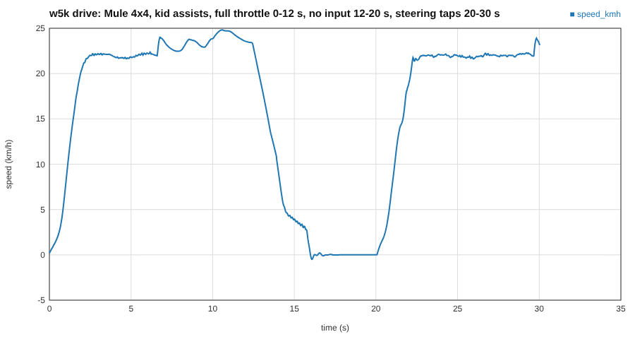

# `w5k drive`: how the live test-drive works, and why the assists are shaped this way

Goal (the owner's): a five-year-old test-drives a vehicle. One native program, the real simulation, a web page for the controls and the picture. The protocol is `docs/swarm/requests/arch-drive-protocol.md`; every number below lives in `content/physics/arch/drive_assist.ron`.

## The loop (a graphics person's view)
The simulation is a fixed-step loop, like a physics engine behind a game: 60 ticks per second whatever the frame rate, so a run is the same on every machine. The wall clock only decides *when* a tick runs, never *what* it computes. Every ~2 ms the thread asks "how many ticks are due?", runs them (at most 4 per wake), and every 2nd tick publishes a frame (30 Hz) to the browser. If the machine is too slow the backlog is dropped and the simulation runs in slow motion rather than spiralling ("the spiral of death": each late frame needs more catch-up ticks, which makes the next frame later still). The browser interpolates between 30 Hz frames, exactly like network smoothing in a game.

Measured on this build machine (dev profile, one core): the live loop with its JSON frames and a browser-style client runs the Mule at about 245 times real time (1814 ticks of 60 Hz in the busy time of 0.12 s); the bare tick loop of the Hauler (6.2 t, the heaviest) at 700 to 1000 times. The budget is not the limit; the 4-tick cap is insurance for a slow laptop.

*One session driven over HTTP exactly as the page will (Mule 4x4 on the slice road): the throttle is eased into the 25 km/h ceiling, the vehicle stops by itself when the pedals go quiet (and holds, no creep), and hard left/right key taps at full throttle still keep to the ceiling.*

## The assists, as control theory
The child's keys are a noisy, jumpy input (0 or 1, instantly). Each assist is a small filter between the key and the powertrain.

- **Speed cap (25 km/h).** The throttle is multiplied by `1 - smoothstep(0.7 cap, cap, speed)`. A hard cut at the cap makes the vehicle lurch (the throttle flips on and off every tick, "bang-bang" control); a smooth ceiling lets the engine ease off and the speed settle just under the cap. If gravity pushes it past the cap (downhill) a proportional brake takes over. Measured on flat ground, full throttle for 30 s: Scout 22.0 km/h, Mule 23.8 km/h, Hauler 22.0 km/h (all under 25).
- **Throttle and brake ramps (slew-rate limiters).** The pedal value may change only by `rise * dt` per tick: 0 to full in 0.8 s, but back to zero in 0.25 s. Think of an animation curve with a capped slope; it stops the torque step that makes a vehicle jerk and pitch.
- **Steering authority and rate.** At speed, lateral acceleration is `v^2 / R`: the same lock angle that is gentle at 3 m/s is violent at 7 m/s. So the reachable lock shrinks from 1.0 to 0.35 between walking pace and the cap, and the wheel may move slower the faster you go (3 per second at a standstill, 1 per second at the cap). A tap on a key then nudges the nose instead of snapping it round.
- **Automatic gearbox always, and no creeping.** The torque converter of an automatic transmits torque at idle, so a stopped vehicle creeps forward unless held. With no pedal down the assist applies a gentle brake (0.25 pedal, about 0.25 g: 6 m/s to rest in 2.6 s over 7 m, measured), and below 0.8 m/s a hold brake (0.7). Pressing the throttle releases the hold within a tenth of a second.
- **Auto-recover.** Three detectors, each with a *dwell time* (the condition must persist, a debounce, so a bounce over a kerb does not count): hull tilted more than 60 degrees from upright for 1 s; speed under 0.3 m/s with the throttle above 0.3 for 3 s; outside the heightfield (2 m margin) or 5 m below its lowest point. The remedy is a teleport: rebuild chassis and powertrain (all internal state cleared, wheels not spinning, suspension at rest) standing on the nearest road point, rear axle on the point, facing along the road. The `reset` input does the same on demand and works with `--no-assist` too.

## What is tested (names are the physics sentences)
`full_throttle_on_flat_ground_holds_every_garage_vehicle_under_the_speed_cap`, `with_no_input_the_vehicle_stops_gently_and_stays_put`, `steering_authority_and_slew_rate_shrink_as_speed_grows`, `a_rolled_hull_is_back_on_the_road_upright_within_two_seconds`, `a_vehicle_held_below_0_3_m_s_with_the_throttle_down_is_recovered_after_3_s`, `leaving_the_terrain_puts_the_vehicle_back_on_the_nearest_road_point_facing_along_it`, the HTTP integration tests (a real server on an ephemeral port), and `the_protocol_document_lists_every_key_the_server_emits_and_accepts`.

## Known limits
- The page itself is VIEWER's. Until it exists `--web` serves whatever folder you give it; without one `/` answers with a hint.
- Wheeled vehicles only (the chassis refuses tracked ones until TRACKS lands; they are skipped from the list with a note on stderr).
- `reverse` is my addition to the owner's input list (a child wants to back up); it is optional and documented.
- The terrain file is produced by WORLD's own exporter (`w5k world export`), through a temporary folder, so the two never drift apart. `RoadPath` in `arch_course.rs` is private, so `session.rs` has its own small `Road`; a refactor into a shared type is a request for later.
- A five-year-old's 25 km/h cap, assist strengths and recovery thresholds are TUNED/ESTIMATE by reasoning, not by play-testing. The first real test with the child is the validation; adjust the RON, not the code.
