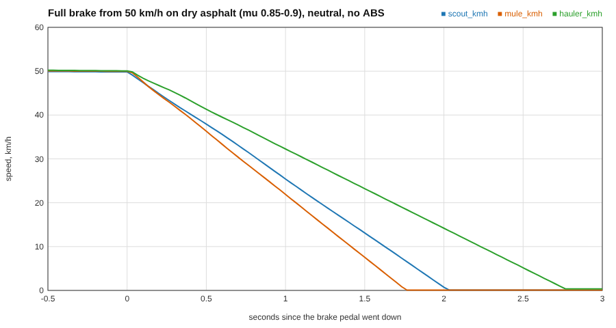
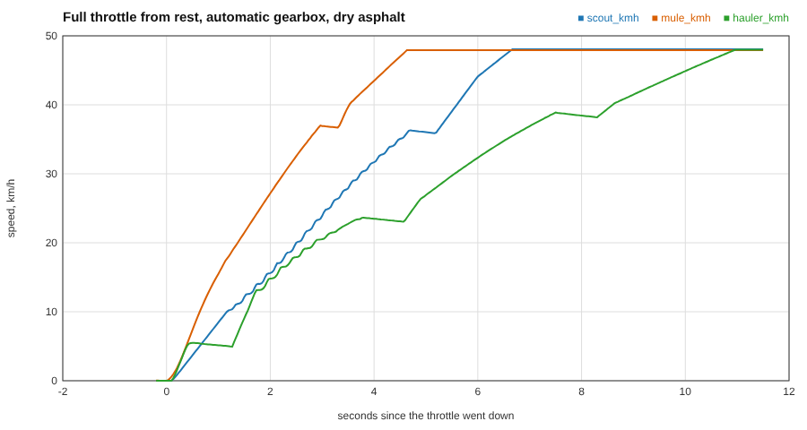

# `w5k scenario proving`: tests that judge the vehicle by its own numbers

`w5k scenario proving --vehicle a.ron[,b.ron] --test <name|all> [--out result.json | DIR]` runs a scripted test on a vehicle and writes the result as JSON (`w5k.proving.result.v1`). VALIDATION's scorer reads it and shows a traffic light. Driver numbers live in `content/physics/arch/proving.ron`; the truck's own numbers are never typed in: they are read from the rig and from the settled chassis.

## Why the result echoes its inputs
A closed-form oracle (a formula with an exact answer) is only fair if it is evaluated on the numbers the simulation actually used. Think of a render test that compares your image with a reference: the reference must use the same camera and lights, or the difference means nothing. So every result carries `inputs` (mass, tyre friction, entry speed), measured *after* the truck has settled on the plane, and the oracle is computed from those.

## Braking from 50 km/h
Ideal friction stop: the brakes can at most turn the tyres' friction into a force `mu m g`, so deceleration is `a = mu g` and, from `v^2 = 2 a d`, the distance is `d = v^2 / (2 mu g)`. Note that mass cancels: a heavy truck stops in the same distance if its brakes and tyres scale with it. The test:

1. Park on the level plane for 1.5 s so the suspension settles; read the static tyre loads. Friction is `mu = sum(mu_i Fz_i) / sum(Fz_i)`, the load-weighted peak friction (surface times tyre grip), the product the tyre model itself uses.
2. Drive up to 50 km/h from rest with the real engine and automatic gearbox (a PI speed controller), hold it within 0.3 m/s for 3 s. The entry speed actually reached is echoed (not the nominal 13.89 m/s).
3. Pedal to the floor, gearbox in neutral (a brake-type test disconnects the engine, so engine braking does not flatter the brakes), no ABS. Measure the distance travelled until the speed is below 5 cm/s and the peak deceleration averaged over 0.25 s.

A simulation that stops *shorter* than `v^2/(2 mu g)` beat friction (a bug). Longer is plausible: brake lag, brake torque limits, load transfer making the front tyres do more of the work than the rear.

*Straight lines are constant deceleration: slopes of 0.83 g (Mule), 0.73 g (Scout), 0.54 g (Hauler). A friction-limited stop on mu = 0.85 to 0.9 would be about 0.9 g, so the Hauler is brake-limited, not tyre-limited.*

## Acceleration 0 to 48 km/h
The vehicle cannot beat two limits, so the best possible time is the larger of them. **Energy**: reaching speed `v` takes kinetic energy `m v^2 / 2`, and the engine delivers at most its peak power `P`, so `t >= m v^2 / (2 P)`. **Traction**: the tyres push with at most `mu f m g` (`f` = share of the weight on driven wheels), so `t >= v / (mu f g)`. The runner echoes `mass_kg`, `power_w` (the engine's peak shaft power over its torque curve up to the redline, times the gearbox efficiency: an upper bound, since the converter and the final drives only lose more), `mu` and `driven_load_fraction` (from the settled static loads) so the scorer can compute that bound. Real trucks sit at a small multiple of it (shift pauses, converter slip, drag): measured Mule 4.6 s (2.0 times the bound), Scout 6.7 s (2.7 times), Hauler 11.0 s (2.4 times).

The test: park (drive selected, parking brake) for 1.5 s, release, throttle to the floor with the automatic box, time to cross 13.33 m/s (interpolated inside the 60 Hz tick that crosses it).

*The plateaus and small dips are gear shifts with the torque cut (the Hauler's slow 2-3 shift is visible at 7 to 8 s): drag and shift pauses are why real trucks sit at two to three times the energy bound.*

## Determinism and early ends
Every test is run twice and the two final state hashes and results must be identical. A run that rolls over, produces a NaN, cannot reach its entry speed or does not stop in time is written with `ended_early` set and no measurements (the scorer makes the whole test red). A test with no runner yet says `not implemented` and writes nothing.
