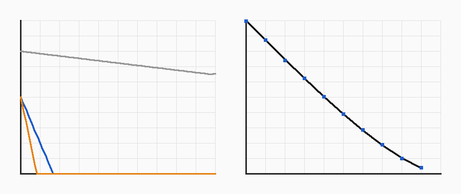

# Spike S-G: can per-vertex flags carry the look?

**Answer: yes, with one rule about loops, one about corners, and a lower default ray count than the brief hoped.** Code: `crates/w5k_geo/src/{mesh,edge,bvh,cavity}.rs` (these are the production kernel, not throwaway), tests and numbers: `crates/w5k_geo/tests/spike_g.rs` (run `cargo test --release -p w5k_geo --test spike_g -- --nocapture --test-threads=1`; set `W5K_SPIKE_OUT=<abs dir>` to write the plot data, then `python3 -I spikes/geometry/plot.py spikes/geometry docs/lanes/geometry/media/s-g.png`). Single thread, Linux container, release build, f64.

*Left: the `edge` flag along the top of the hood, from the chamfer edge (x, 0 to 0.3 m) against 0..1 (y): grey = no inset loop (the value smears over the whole 0.6 m face), blue = one loop 5 cm in, orange = one loop 2.5 cm in. Right: `cavity` at the foot of a wall, 1024-ray bake (blue squares) on the closed-form circular-segment curve (black), d = 0 to 0.5 m.*

## 1. The `edge` flag (oracle A6 reproduced)
Rule as in the brief: per mesh edge, the turning angle between its two face normals, **convex only**, ramp 20 to 70 degrees (value = clamp((angle - 20) / 50)), concave 0; a vertex takes the maximum of its edges. Checked: box edge 1.0; the two edges beside a 45 degree chamfer 0.5; an L-prism's concave crease 0; every side edge of a 128-gon wall 0 (turn 2.8 degrees), only the 256 rim edges are 1.

Why loops: the GPU interpolates a vertex value linearly across a triangle (barycentric, exactly what Gouraud shading did). So a value can only change where a vertex is. A hood whose top face is one rectangle has the chamfer's 0.5 at its edge and 0 only at the *far* edge: the whole face is smeared. **An inset loop placed at distance d from the edge makes the band exactly d wide** (the value falls linearly from the edge to the loop). Measured on the 1.5 x 1.2 x 0.1 m hood, 15 mm chamfer, interpolated at the middle of a long edge:

| rings (hood) | triangles | value mid-edge (oracle 0.5) | width to 0.25 | width to 0.05 |
|---|---|---|---|---|
| 4-vertex rings, no loop | 20 | 0.80 | smeared over the face | smeared |
| 4-vertex rings, 1 loop at 5 cm | 28 | **0.80** | 3.5 cm | 4.7 cm |
| 8-vertex rings (mid-side vertices), 1 loop at 5 cm | 60 | **0.50** | 2.5 cm | 4.5 cm |
| 8-vertex rings, 1 loop at 2.5 cm | 76 (two loops) | 0.50 | 1.3 cm | 2.2 cm |
| the same face by plain subdivision to a 5 cm pitch | 1440 (top face only) | | | |

Findings:
1. **One loop per hard edge, at the band width you want (5 cm default).** More loops do not widen the band; they only narrow it (every loop carries 0).
2. **Corners smear along the edge.** With only corner vertices, the corner's hip-edge value (0.8) is interpolated along the whole straight edge, 60% above the true 0.5. A vertex at mid-side fixes it (exact 0.5). Rule for the generators: hard-edge rings carry a vertex at least every 0.5 m (ESTIMATE, reason: that keeps the interpolation error under the 0.3 corner excess over 0.25 m). Corners being brighter than the middle is physically right (wear starts at corners), so the rule limits how far the brightness runs, not whether it exists.
3. **Cost.** A loop costs 2 triangles per ring vertex. In isolation the hood goes 44 to 60 triangles (+36%) for 8-vertex rings, 20 to 28 (+40%) for 4-vertex rings: this nominally crosses the kill line (+25%), but a hood is the worst case (almost no surface per edge); against the subdivision alternative (1440) it is 24x cheaper. **The kill test needs a whole vehicle: I will measure it on the HMMWV (build step 6) and add a CI check that loops stay under 25% of the triangles; if they do not, the fallback is a per-edge-class budget, not dropping the flag.**

## 2. The `cavity` bake (oracle A7 reproduced; BVH against brute force)
Definition as in the brief: blocked fraction of cosine-weighted rays (Hammersley: u = (i + 0.5)/N, v = bit-reversed i) up to a cap of 0.5 m; origin lifted along the normal. **A7 reproduced:** at the foot of a wall the bake follows (arccos a - a sqrt(1 - a^2)) / pi, a = d/L, worst absolute error 0.0033 at 1024 rays (limit 0.02), 0.011 at 128, 0.014 at 256; 0.5 at the crease (d = 0.1 mm); 0 exactly on an open plate. One finding: **a sample exactly on a surface has no side to leave by** (every ray meets the plane at t = 0), so the bake lifts the origin off the surface (0.1 mm in the test; the production default will be 0.5 mm, ESTIMATE).

Cost on a stand-in for one vehicle (a 29,768-triangle, 15,129-vertex relief with 0.3 m bumps, so a lot of occlusion; BVH built in 28 ms):

| rays per vertex | BVH bake, one thread | against the brief's 10 s kill |
|---|---|---|
| 128 | 1.6 s | ok |
| 256 | 3.1 s | ok |
| 1024 | 11.6 s | **over** |
| brute force, 128 rays | about 570 s (measured 38 ms per vertex, extrapolated) | 350x slower |

The BVH and brute force agree on all 2,560 sampled rays. **Decision: default 256 rays** (3 s per vehicle, error under 0.015 on the oracle); 1024 only in the oracle tests. The bake runs at export or compile time, never per frame, and a vehicle that bakes slowly is a vehicle with too many vertices, which the triangle budget already polices.

## 3. What is not answered
Triangle cost of wear on a real vehicle (needs the HMMWV); bake time on Windows (CI); whether LOOK wants the 0.5 cap or a longer one (their call, it is a parameter).
