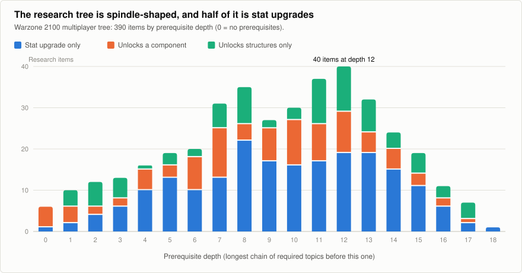

# Research Tree Analysis (data)

**Snapshot:** Warzone 2100 `master` @ `d7ce18df8d` (2026-10-07), multiplayer ruleset (`data/mp/stats/research.json`),
unless stated. **Method:** the prerequisite graph was built by `tools/research/wz_research_graph.py`. Full output:
[`../data/research-tree-analysis.md`](../data/research-tree-analysis.md); every item:
[`../data/research-tree-full-list.md`](../data/research-tree-full-list.md).
`requiredResearch` is treated as **AND** (all listed items needed); see [01-mechanics.md](01-mechanics.md) for the
engine's confirmation.

## 1. Headline numbers

| Measure | Multiplayer | Campaign (`base`) |
|---|---:|---:|
| Research items | **390** | 413 |
| Root items (no prerequisite) | 6 | 53 |
| Longest prerequisite chain | 19 items | 16 items |
| Mean prerequisites per item | 1.40 (max 4) | 1.37 (max 3) |
| Items with 2+ prerequisites | 142 (36%) | 187 (45%) |
| "Corridor" items (exactly 1 in, 1 out) | 84 (22%) | n/a |
| Leaf items (nothing depends on them) | 118 | 112 |
| Total research points, whole tree | 3,590,910 | 3,324,630 |
| Median / max single item (points) | 6,000 / 56,600 | 6,000 / 60,000 |
| Total power cost, whole tree | 85,414 | 83,861 |
| Costliest single prerequisite chain | 220,510 pts | 173,000 pts |

The six multiplayer roots are: Engineering, Sensor Turret, Construction Unit (Truck), Light Body (Viper), Wheeled
Propulsion and Machinegun. Everything else descends from those.

## 2. What research items actually *do*

| Effect of the item | Count | Share |
|---|---:|---:|
| Pure stat upgrade (`results` only) | 204 | 52% |
| Unlocks components (weapons, bodies, propulsion, turrets) | 96 (+3 combined) | 25% |
| Unlocks structures | 86 (+3 combined) | 22% |

*This is the single most important fact about the tree: just over half of it is a stat treadmill.*

**Components unlocked** (designable ones): 77 weapons, 14 bodies, 5 propulsions (wheels, half-tracks, tracks, hover,
VTOL), 6 sensors/CB/VTOL-strike turrets, 2 repair turrets, 1 truck, 1 command turret. Of the 77 weapons, **25 are VTOL
variants** of ground weapons and **9** are anti-air only (one is both), so there are roughly 40-45 distinct
ground weapon ideas.

**Structures unlocked:** research unlocks 90 individual structures, of which **72 are defensive structures**
(towers, emplacements, hardpoints), 4 are fortresses and 4 are wall or gate pieces. Only **10 are infrastructure**
(command relay, cyborg and VTOL factories, factory/research/power modules, repair facility, rearm pad, satellite
uplink, laser satellite). In practice each new weapon spawns several defensive structures, so "content" is
multiplied by research.

> **Theory note (vertical vs horizontal progression).** *Vertical* progression makes the same things stronger
> (+25% damage). *Horizontal* progression adds new options (a new weapon). Vertical progression is cheap to author
> and easy to balance but does not create new decisions; horizontal progression creates decisions but needs content
> and creates balance risk. Warzone 2100's multiplayer tree is roughly **half vertical**, with the vertical steps
> being *uniform* (see §5), which is why upgrade research can feel like a tax rather than a choice.

## 3. Shape of the tree

Items per prerequisite-depth ("wave"), with average cost:

| Depth | Items | Avg points | | Depth | Items | Avg points |
|---:|---:|---:|---|---:|---:|---:|
| 0 | 6 | 662 | | 10 | 30 | 7,796 |
| 1 | 10 | 840 | | 11 | 37 | 7,770 |
| 2 | 12 | 1,100 | | 12 | 40 | 10,578 |
| 3 | 13 | 1,569 | | 13 | 32 | 13,462 |
| 4 | 16 | 2,278 | | 14 | 24 | 22,617 |
| 5 | 19 | 3,074 | | 15 | 19 | 22,374 |
| 6 | 20 | 4,280 | | 16 | 11 | 25,091 |
| 7 | 31 | 4,977 | | 17 | 7 | 32,114 |
| 8 | 35 | 4,817 | | 18 | 1 | 24,000 |
| 9 | 27 | 6,430 | | | | |

- The tree is **spindle-shaped**: narrow start (6 roots), widest around depth 8-13 (about 30-40 items per wave),
  then it narrows to a handful of end-game items.
- **Cost grows roughly 50x** from wave 0 to wave 17 (about 660 to 32,000 points), a smooth escalation.
- The **early game is a narrow corridor**: a few cheap choices (Machinegun, Viper, Wheels) and then a fork.
- 84 items (22%) are "corridor" nodes with one parent and one child, i.e. pure waiting steps with no choice.

### Gatekeepers (items that gate the most of the tree)

| Item | Transitive dependents |
|---|---:|
| Sensor Turret | 266 |
| Command Relay Post | 263 |
| Research Module | 261 |
| Engineering | 261 |
| Research Upgrade 1 (Synaptic Link) | 236 |
| Fuel Injection Engine (Mk 1) | 201 |
| Machinegun | 149 |
| Power Module | 142 |

Roughly **two thirds of the tree sits behind the Research Module and Engineering**. The first engine upgrade alone
gates 201 items, because bodies and hover depend on the engine line (§4).

## 4. Coupling between lines (what depends on what)

Cross-line prerequisite edges, strongest first:

| Prerequisite line | Gates | Edges |
|---|---|---:|
| Weapons (rocket, AA, rail, missile, MG, cannon, laser...) | Defensive structures | at least 50 (summed over the top-30 edge list) |
| **Armour ("Metals")** | **Bodies** | **9** |
| **Engine** | **Bodies** | **5** |
| Cyborg armour | Super-cyborg weapons | 5 |
| Research module and research upgrades | Sensors, MG, tank armour, power (and others) | 4 / 4 / 3 / 2 |

**Chassis are gated by armour and engine research.** Which lines gate each designable body:

| Body | Needs (besides other bodies) |
|---|---|
| Viper | nothing (root) |
| Cobra | Factory Module |
| Bug | Composite Alloys (armour 1) |
| Scorpion | Bug, Composite Alloys Mk2 |
| Python | Cobra, Composite Alloys Mk2 |
| Leopard | Composite Alloys Mk3 |
| Mantis | Scorpion, **Fuel Injection Engine Mk3** |
| Panther | Leopard, Cobra, Dense Composite Alloys |
| Tiger | Python, Panther, Dense Composite Alloys Mk2 |
| Retaliation | Superdense Composite Alloys, **Turbo-Charged Engine Mk2** |
| Retribution | Retaliation, **Turbo-Charged Engine Mk3**, Superdense Composite Alloys Mk2 |
| Vengeance | Retribution, Superdense Composite Alloys Mk3, **Gas Turbine Engine** |
| Wyvern | **Gas Turbine Engine Mk3**, High Intensity Thermal Armor Mk3 |
| Dragon | Wyvern |

So the engine and armour upgrade lines are not mere stat boosts; they are the **technology spine** that opens up
heavier and better bodies. Hover propulsion also needs Engine Mk2, and the VTOL propulsion is a prerequisite
of Engine 7 (Gas Turbine).

> **Theory note (gating).** A prerequisite edge from an upgrade line to a component is a way of forcing the player
> to *invest in a capability before it pays off*. It also means a player who skips the engine line is locked out of
> several bodies, a real strategic trade-off that the tree creates without any extra rules.

## 5. The upgrade lines are uniform

Almost every upgrade chain is a ladder of **identical** steps:

| Line | Steps | Step size | Cumulative | Cumulative research points |
|---|---:|---|---|---:|
| Tank armour (Droids) | 9 | +30% armour and +30% HP, each | +270% | 86,400 |
| Tank thermal armour | 9 | +40% each | +360% | 116,800 |
| Cyborg armour | 9 | +35% | +315% | 70,800 |
| **Engine power (Droids)** | **9** | **+5% (x7), +7%, +8%** | **+50%** | **80,400** |
| MG damage | 10 | +25% | +250% | 65,800 |
| Cannon damage | 9 | +25% | +225% | 61,250 |
| Rocket damage | 9 | +25% | +225% | 54,000 |
| Cannon rate of fire | 6 | -10% fire pause | -60% | 54,000 |
| Rocket accuracy | 4 | +10 hit chance each | +40 | 21,600 |
| Research speed (facility) | 9 | +30% | +270% | 62,000 |
| Power generator output | 7 | +25 to +50% | +215% | 52,200 |
| Walls | 12 | +30% HP, +35% armour | +360% / +420% | 137,200 |

Observations:
- **Engines get the stingiest upgrade line** in the game (+50% total for about 80,000 points) compared with armour
  (+270%) and weapon damage (+225 to +250%). With engine output scaling so little while armour and damage scale a
  lot, upgrades shift the balance *away from mobility* as the game progresses. The speed formula
  ([04-engine-and-speed.md](../unit-design/04-engine-and-speed.md)) shows the engine only matters for the 38-56% of ground
  designs that are not already at their propulsion's speed cap.
- Steps are **flat, additive and uniform**, which is easy to understand but means that *the order of
  upgrades doesn't matter*, only the total spent. There is no "choose this OR that" in the upgrade ladders.
- Upgrade chains cost **54,000 to 137,000 points** each, i.e. a single line is worth about 1.5% to 4% of the tree.

## 6. Cost and pacing (raw numbers)

- Whole tree: **3.59 million research points** and **85,414 power**. A typical (median) item is 6,000 points; the
  very late items run 43,200-56,600 points and 450 power each (450 appears to be a cap).
- The most expensive chain to reach any single item sums to **220,510 points**.
- Research-rate numbers (what a lab produces per second) and the resulting game time are in
  [01-mechanics.md](01-mechanics.md): in an hour, five fully upgraded labs complete only about **a third** of the tree.

## 7. Campaign tree versus multiplayer tree

| | Multiplayer | Campaign |
|---|---|---|
| Entry points | 6 roots; player starts with almost nothing researched | **53 roots**: many topics are entered via *artifacts* or mission grants |
| Philosophy | Open tree, everybody researches everything | Scripted pacing: missions hand out or unlock topics |
| Propulsion progression | One tier of each propulsion; upgrades via research | **Tiered variants**: Wheels / Half-tracks / Tracks / Hover / VTOL each have **II and III** versions |
| Typical depth | 19 chain | 16 chain |

The campaign's *tiered propulsion* is a different answer to "how does a component improve?": instead of a
percentage research upgrade, you unlock a **new variant** with a different trade-off. Example (campaign data):

| Variant | Weight | HP % of body | Power cost |
|---|---:|---:|---:|
| Tracks I | 650 | 400% | 125 |
| Tracks II | 600 | 600% | 200 |
| Tracks III | 550 | 800% | 275 |
| Wheels I / II / III | 250 / 200 / 150 | 100% / 200% / 300% | 25 / 75 / 125 |
| Hover I / II / III | 200 / 150 / 100 | 150% / 200% / 300% | 100 / 150 / 200 |

(Campaign propulsion II/III need Factory Upgrade 4 and cost 3,600 to 14,400 points each.) The multiplayer ruleset
dropped these tiers. This shows that the **engine already supports "Mk II / Mk III" component variants** purely via
data.

## 8. Findings for our design work

These are interpretations, not facts about Warzone 2100.

1. **Research is mostly a treadmill in WZ2100.** If the goal is research that is "bigger, bolder and more
   impactful on gameplay", the largest gap is converting uniform percentage steps into *choices* with
   consequences (exclusive branches, specialisations, capability unlocks, trade-offs).
2. **Gating by capability lines works.** Armour and engine lines gating bodies is a good, cheap mechanism that
   our design could extend (engines gating propulsion classes; reactor/armour tech gating weapon mounts).
3. **There is no research choice between mutually exclusive options.** `requiredResearch` is AND only, and no
   item hides another (apart from `disabledWhen` flags used for campaign/tech-level setup). Exclusive branches
   would be a new mechanism.
4. **Defensive structures are a content multiplier**: 72 structure unlocks come from weapons. Our research tree
   could do the same with new component classes.
5. **Pacing is front-loaded in choice and back-loaded in cost.** The first 6 waves are cheap but narrow; the last
   6 waves are wide but 5-10x more expensive per item.
