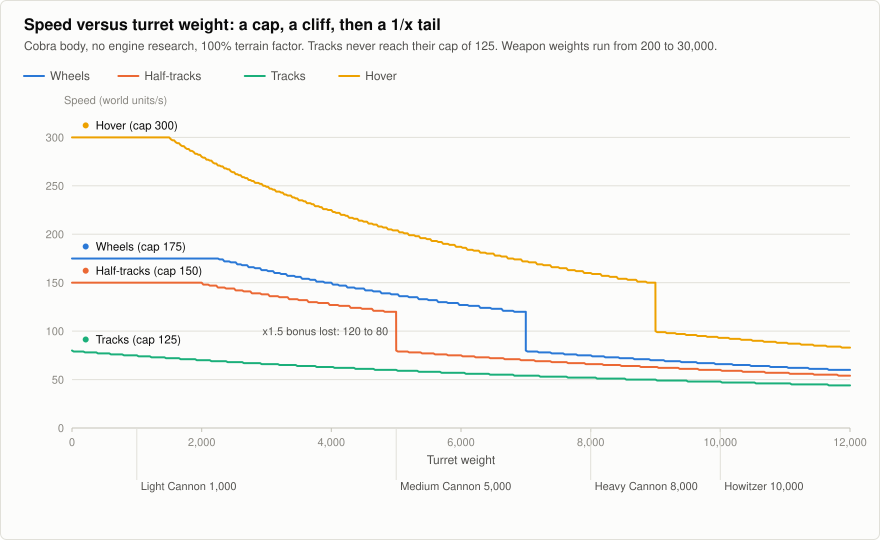
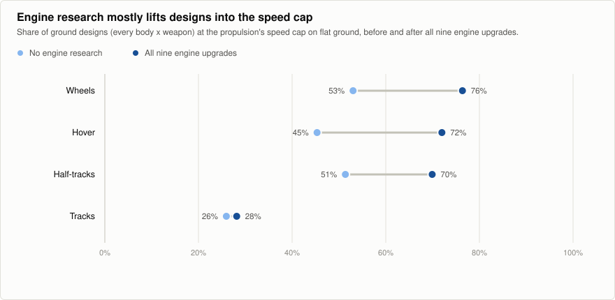

# Engine and Speed Model

**Snapshot:** Warzone 2100 `master` @ `d7ce18df8d`, multiplayer ruleset unless stated. **Evidence:** the speed and turning code
was read by an analysis agent and the core formulas were re-read by me (`src/droid.cpp:1792-1836`,
`src/move.cpp:1683-1758, 1968-1969`); the numbers are recomputed by `tools/research/wz_speed_model.py`. Generated tables:
[`speed-table`](../data/speed-table.md), [`speed-saturation`](../data/speed-saturation.md),
[`speed-by-weapon`](../data/speed-by-weapon.md).

## 1. Summary

1. **There is no engine component.** The "engine" is one number on the body, `powerOutput` (5,000 to 30,000). Research can
   raise it by up to **+50%** (nine steps).
2. **Speed is power divided by weight**, times a per-propulsion factor, then **clamped by a per-propulsion speed cap**.
3. **Propulsion weight is a percentage of the body's weight**, so propulsion type usually dominates total weight; the
   weapon matters mostly for the heaviest weapons and for light propulsion.
4. There is a **x1.5 bonus** when the body's *un-upgraded* power exceeds the design's total weight. It switches off abruptly,
   a **33% cliff**, and research can never move the threshold.
5. Because of the cap, **the engine is invisible for roughly half of all ground designs on flat ground** (44% with no
   research, 62% with all engine research), and for 72% on roads. It matters mainly for **heavy tracked designs** and for
   **agility** (turning scales with the *uncapped* base speed).

## 2. The model

### Step 1: base speed (computed when the droid is built)

```
total weight W  = body_weight * (100 + propulsion_weight) / 100  +  sum of turret/system weights
base speed      = floor( M * P / max(1, W) )
   P = body power output, including engine research;  M = the propulsion type's multiplier
if the propulsion is Lift (VTOL):  heavy body -> base / 4 ;  medium body -> base * 3 / 4
if the body's UN-UPGRADED power > W:   base = base * 3 / 2
```

The multiplier `M` (multiplayer): wheeled, half-tracked, tracked **80**; hover, legged, propellor **100**; lift **140**
(campaign: hover 120, lift 130). The result is stored on the droid and refreshed when engine or HP research completes (it
is *not* refreshed if a component is swapped in place).

### Step 2: speed on this tile (computed every update)

```
v = floor( base * terrain_factor[tile][propulsion type] / 100 )
v = min( v, propulsion_max_speed )                  <- the cap; the only cap
v = v * (100 + 5 * rank) / 100                      <- rank and commander bonus apply AFTER the cap
v = v scaled by slope: uphill slows, downhill speeds up (cyborgs, persons and VTOLs ignore slope)
minimum 10
```

then: a weapon without "fire on move" holds the unit still for 1.5 s after firing; an EMP hit stops it for 10 s; the optional
"formation speed" limits a group to its slowest member's **base** speed; speed ramps down within 3 tiles of the destination.
Units/terrain factors: see [03-propulsion.md](03-propulsion.md).

### Steering and agility (this is where the uncapped value matters)

For ground units, turn rate and pivot rate are `base speed * propulsion turnSpeed` and `base speed * propulsion spinSpeed`.
The code uses the **uncapped** `baseSpeed` (`move.cpp:1968-1969`), while movement speed uses the capped value. So excess engine
power that the speed cap throws away still buys **faster turning**. Defaults: acceleration 250, deceleration 800, skid
deceleration 600, turn speed 60 (one third of a degree per unit of base speed), spin speed 136, pivot threshold 180
degrees; tracks pivot at 65 degrees, cyborgs use a separate model with no skid. Examples: a tracked Cobra turns at about 20
degrees/s while moving and pivots at about 45 degrees/s; a hover Cobra (base 204) turns at about 67 degrees/s and pivots at 152
degrees/s but drifts heavily (skid 120).

> **Theory note: what this model is.** *Power-to-weight ratio* is the standard first-order measure of vehicle performance:
> acceleration is roughly force over mass, and force available is limited by engine power. Real top speed is set where engine
> power meets resistance (drag, rolling friction, gearing). Warzone 2100 simplifies this to **speed = k x power / weight**
> (a hyperbola: double the weight, half the speed) and models "drag and gearing" crudely as a **hard cap per locomotion
> type**. A hard cap creates a *plateau*: beyond it, extra power is wasted, so the engine stops being a decision.

## 3. The curve



How to read it (Cobra: engine power 15,000, body weight 2,000):

- **Plateau (left):** light turrets leave so much spare power that the cap decides the speed. Hover plateaus at 300 up to a
  turret weight of about 1,500; wheels at 175 up to about 2,300; half-tracks at 150 up to about 2,000. **Tracks never reach
  the cap**: their +650% weight already uses up the power.
- **1/x fall:** past the plateau, speed falls as the turret gets heavier.
- **Cliff:** where total weight reaches the body's un-upgraded power (15,000), the x1.5 bonus is lost and speed drops by a
  third in one step. The cliff sits at turret weight **5,000 for half-tracks, 7,000 for wheels, 9,000 for hover**; tracks
  are already past it. For half-tracks, a 4,999-weight turret gives 120 and a 5,000-weight turret gives 80.

## 4. Worked examples

All on flat ground at 100% terrain factor, rank 0, multiplayer stats. "Raw" is the uncapped base speed.

| Design | Total weight | Base speed (raw) | Speed | Why |
|---|---:|---:|---:|---|
| Cobra + tracks + Medium Cannon | 20,000 | 60 | **60** | no bonus (W > 15,000); far below the cap of 125 |
| the same with all 9 engine upgrades (P = 22,500) | 20,000 | 90 | **90** | speed scales with power when uncapped |
| Cobra + wheels + Medium Cannon | 13,000 | 138 | **138** | bonus applies (13,000 < 15,000); cap 175 not reached |
| Cobra + half-tracks + Medium Cannon | 15,000 | 80 | **80** | exactly at the threshold: no bonus |
| Cobra + hover + Medium Cannon | 11,000 | 204 | **204** | bonus applies; cap 300 not reached |
| Viper + wheels + Machinegun | 2,600 | 229 | **175** | capped: the engine is wasted |
| Tiger + tracks + Heavy Cannon | 32,750 | 43 | **43** | heavy and slow: here engine research matters |
| the same with all 9 engine upgrades (P = 27,000) | 32,750 | 65 | **65** | +50% speed |
| Cobra + VTOL + VTOL Lancer | 3,250 | 726 | **700** | capped (air terrain factor is 250%) |
| Tiger + VTOL + VTOL Lancer | 5,200 | 181 | **452** | heavy VTOL: /4 penalty, x1.5, then x2.5 terrain factor |

The speed-by-weapon table shows how little a normal weapon matters on tracks: on a tracked Cobra every weapon up to about
1,000 weight (Machinegun to Light Cannon) gives 75 to 78; a Rail Gun (2,000) gives 70; a Heavy Cannon (8,000) about 52.

## 5. How often the engine matters

I counted every body x propulsion x weapon design (single weapon): 14 x 4 x 52 = **2,912 ground designs** and 14 x 27 VTOL
designs, and asked how many have their speed pinned by the cap.

| Terrain context | Engine research | Ground designs at cap | VTOL designs at cap |
|---|---|---:|---:|
| Neutral (100%) | none | **44%** | 56% |
| Neutral | all nine | **62%** | 79% |
| Road | none | 62% | 56% |
| Road | all nine | 72% | 79% |
| Off-road (sandy brush) | none | 37% | 56% |
| Off-road | all nine | 58% | 79% |



By propulsion (neutral terrain, ground weapons): the x1.5 weight bonus applies to 76% of wheeled, 70% of half-tracked,
81% of hover and only **28% of tracked** designs. Tracks are the one propulsion where the engine really bites; for the rest,
research mostly **moves more designs onto the plateau**.

Consequences:
- For **44% of designs, engine research changes nothing at all for straight-line speed on flat ground**, and for a further
  18% it helps only until the design reaches the cap. The more engine research you do, the more designs sit on the plateau
  (the research line *creates* wasted engine).
- Where the engine works, it is nearly linear: median gain x1.50 (+50% power gives +50% speed), because the formula is
  proportional to power when uncapped.
- The **engine bonus threshold ignores research**, so the "weight cliff" never moves; the x1.5 bonus rewards low-weight
  designs permanently.
- Gameplay balance has repeatedly used body engine power as a lever (the changelog: "make Leopard and Panther have higher
  engine power output thus move faster with more weapons"; "update unit speed when researching engine upgrades").

## 6. The engine research line

Nine strictly sequential topics, class "Droids" bodies only (cyborgs and transports are not upgraded):

| Item | Gain | Points | Power | Notes |
|---|---:|---:|---:|---|
| Fuel Injection Engine 1-3 | +5% each | 1,200 / 2,400 / 4,800 | 37 / 75 / 150 | Engine 1 gates 201 other items |
| Turbo-Charged Engine 1-3 | +5% each | 7,000 / 9,000 / 11,000 | 218 / 281 / 343 | Engine 4 needs Research Upgrade 4 |
| Gas Turbine Engine 1-3 | +5%, +7%, +8% | 13,000 / 15,000 / 17,000 | 406 / 450 / 450 | Engine 7 needs VTOL propulsion and Metals 7; Engine 8 needs the Retribution body; Engine 9 needs the Vengeance body |

- Total: **80,400 research points** and **2,410 power**, only about 2.2% of the whole tree's points.
- Research rate: a lab makes 14 points/s, +7 with a module = 21/s; nine research-upgrade topics (+30% of the base 14 each,
  rounded up to +5 each) take a lab to 59/s, or 66/s with the module's fixed +7. The engine chain is sequential, so extra labs do
  not shorten it: about **64 minutes at 21/s or 20 minutes at 66/s**.
- Engine research is a **prerequisite for bodies**: Mantis needs Engine 3, Retaliation Engine 5, Retribution Engine 6,
  Vengeance Engine 7 and Wyvern Engine 9; Hover propulsion needs Engine 2.
- Step size for comparison: armour +30% per step, damage +25% per step, but engine only **+5%**: the engine line is the
  stingiest upgrade line in the game.

The research tree analysis is in [../research-system/03-tree-analysis.md](../research-system/03-tree-analysis.md).

## 7. Quirks and sharp edges (all confirmed in code)

1. **The x1.5 cliff** (above): a 33% speed drop for +1 weight.
2. **Rank and slope bonuses apply after the cap**, so a veteran tracked unit going downhill can exceed its propulsion cap.
3. **Terrain bonuses above 100% are wasted when the cap binds** (hover on sand, wheels on road).
4. **Unit mismatch:** the same JSON keys (`spinSpeed`, `turnSpeed`) mean "angle units per unit of base speed" for ground
   units but "degrees per second" for VTOLs.
5. **Formation speed uses the minimum *uncapped* base speed** of the group, not the capped speed.
6. **Derived values are cached.** Replacing a part via research does not recompute them; only engine/HP upgrades do.
7. **The campaign engine line is +45%** (nine steps of +5), the multiplayer line +50%.
8. **The design screen's water speed is zeroed for every type except hover and lift**, which wrongly includes the water-only
   "Naval" type (a UI bug).
9. **Pathfinding ignores speed entirely** (see [03-propulsion.md](03-propulsion.md)).
10. **Speed, turn and acceleration are not upgradable by research**; only body power is.

## 8. History and community notes (lower confidence: forum/mod search excerpts)

- A community forum thread (written for the 2.x/3.x text-file stats) derived the same shape: *speed = propulsion value x boosted
  engine power / total weight*, with propulsion weight a percentage of the body's weight, and nine engine tiers from 105% to 150%.
  This matches the current code.
- The same era's *Enhanced Balance* mod reported that "about 90% of weapon, body and propulsion combinations hit top speed",
  making engine upgrades and terrain irrelevant, and reworked each propulsion's speed profile. The numbers above show the problem
  persists in a milder form (44-62%).
- *Contingency* gave bodies in a higher tier **smaller engines**, so that higher tiers depend on engine research to keep their
  speed, and split bodies into an "armour-line" family and an "engine-line" family. *Battleplan* added a weight factor so that
  heavy hovers are not faster than light wheeled units.
  See [../community-precedents.md](../community-precedents.md).

## 9. Findings for our design work

1. **The shape of the model is sound and cheap to reason about.** Power over weight with a locomotion-specific limit is easy
   for players to understand and for designers to tune.
2. **A hard cap makes engines a "solved" attribute for most designs.** If engines are to be a real decision, speed should
   have *no flat plateau* (soft saturation, or separate axes for acceleration, top speed, climbing and fuel), or the cap
   should vary with something the player chooses (engine class, gearing, locomotion).
3. **Weight-percentage propulsion makes propulsion choice dominate speed**; weapon weight matters little on tracks and a lot on
   hover/VTOL. That asymmetry is a feature worth keeping or a bug worth fixing, but it should be a conscious choice.
4. **The x1.5 threshold bonus is an accident of design**, a hidden discontinuity that rewards light builds. Avoid
   discontinuities that players cannot see (the design screen does not show total weight).
5. **Agility scaling with uncapped speed is hidden depth** worth keeping: engine surplus buys manoeuvrability when speed is
   capped, so the engine has a second, independent role.
6. **Engine research should not be the stingiest line** if engines matter; and if engine output is both a body trait and an
   upgrade target, the threshold logic should read the upgraded value.
7. A separate engine component would need **no changes to the physics**: the model consumes only `weight` and `base speed`.
   The work is plumbing (a new template slot, data key, network format, UI, and the upgrade registry).
