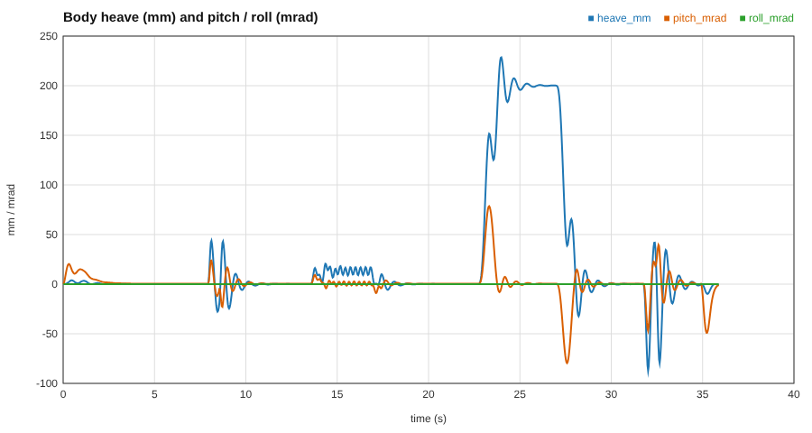
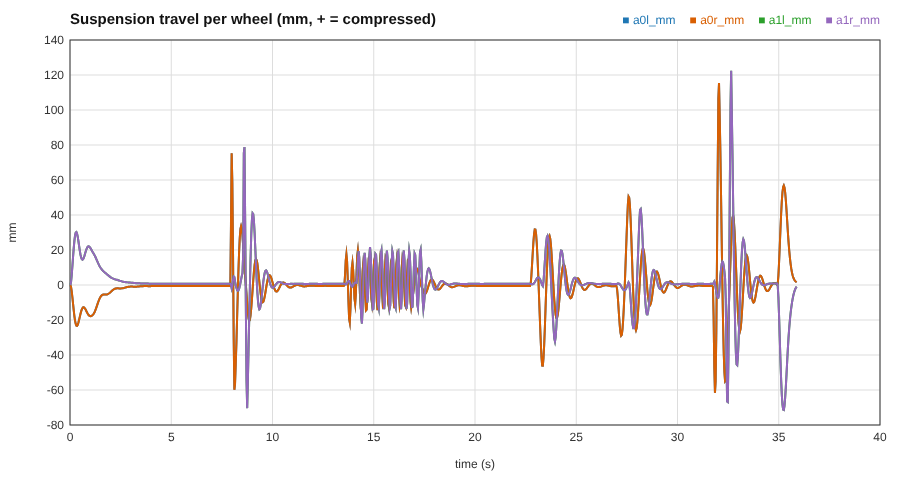

# The physics of a chassis (CHASSIS lane, in plain language)

*Grows with each PR. This first section covers the quarter car.*

## A corner of a car is two masses and two springs
Take one wheel's share of a truck: the **sprung mass** (hull share, about 400 kg), the **unsprung mass** (wheel, tyre, hub, about 50 kg), the **spring and damper**
between them, and the **tyre**, which is another spring to the road. Two masses means two ways to wobble: the **body mode** (the whole hull bouncing on the
suspension, about 1.3 Hz, like a boat on swell) and the **wheel hop** (the light wheel shaking between road and spring, about 12 Hz). A car that feels "floaty" has a low
body frequency; one that feels "harsh" has a high one. Designers pick **ride frequency** and **damping ratio** and the spring and damper rates follow:
`k = m (2 pi f)^2`, `c = 2 zeta sqrt(k m)`.

## Damping ratio, and the camera analogy
`zeta` is how much of the bounce survives each cycle: 0 never stops, 1 returns without overshoot (critical damping), cars sit at 0.2 to 0.4 so they absorb a bump but
do not feel dead. A critically damped spring is exactly the "smooth damp" every engine uses to make a camera follow a target. You can measure `zeta` from a ringing
trace: each peak is smaller than the last by a fixed ratio, and the natural log of that ratio (the **log decrement** `delta`) gives `zeta = delta / sqrt(4 pi^2 + delta^2)`.

## Why the simulation steps the way it does
We update velocity from force first, then position from the *new* velocity (**semi-implicit Euler**). Unlike plain Euler, this does not add energy every step: it conserves a
slightly distorted energy exactly, so an undamped oscillator rings forever instead of blowing up or dying. The bench test measures the energy after a minute of ringing and
requires less than 0.1% change. The price is that the step must be small compared with the fastest oscillation: stable below `omega dt = 2`, accurate with about 20 steps per period
(spike S1, `docs/lanes/chassis/spike-s1.md`).

## How we know it is right: oracles
The two-mass system has an exact answer. With `det [[k - ms w^2, -k], [-k, k + kt - mu w^2]] = 0` the natural frequencies come out of a quadratic in `w^2`. The tests
(`quarter_car_*`) simulate and compare with that closed form: frequency within 1%, damping ratio within 5% (in the limit where one mass is rigid and `zeta = c / (2 sqrt(k m))`
is exact), static deflection equals `m g / k`.

## The suspension element: spring, damper, stop
**Spring.** A coil is `F = F0 + k x`. Real suspensions are rarely that simple, so the element supports every kind in the rig: a *table* (leaf packs and rubber, force read off a curve); a
*torsion bar* (the bar twists through an arm, so the force at the wheel is `T / (L cos phi)`: as the arm rises its lever shortens and the preload's push on the wheel changes, so the wheel rate at
rest is `k / (L cos phi)^2 - P sin(phi) / (L cos^2 phi)`, not just `k / L^2`); and a *hydropneumatic* strut (a gas bag: `p V^gamma = const`, so it gets stiffer the more it is squeezed,
a spring that is progressive for free). A spring can push but never pull, so its force is floored at zero.
**Damper.** Force proportional to speed, `F = c v`, with a bigger coefficient in rebound than bump (so the wheel drops back slowly but the hull is not hammered by a bump), and a *knee*: above a
set speed the damper bleeds (digressive), because a valve blows off. Dry friction in a leaf pack is `F_f tanh(v / v_s)`: Coulomb friction smoothed over a small speed `v_s` so the
integrator does not chatter around zero speed.
**Bump stop.** A rubber block that engages near full travel, stiffening as it squashes. If a rig declares a *hard* limit, the travel is clamped and the approach speed is reflected with a
restitution coefficient: a bounce, not a spring that grows without bound.

## The tyre: a slip-force curve, a friction circle, and a patch that remembers
**Slip.** A tyre produces force only when its patch slides a little against the road. Longitudinal *slip ratio* `kappa = (wheel speed - ground speed) / speed`; sideways *slip angle*
`alpha`, the angle between where the wheel points and where it is going. For small slip the force is a straight line: `Fx = C_kappa Fz kappa`, `Fy = -C_alpha Fz alpha` (the
stiffness is "per unit load", which is why a heavy truck on the same tyres corners harder). The tests check those slopes against the stated stiffness.
**Friction circle.** The road can give at most `mu Fz` in total, in any direction. Spend it all on braking and nothing is left for steering: the force *vector* is capped on a circle of radius `mu Fz`.
**Relaxation length.** The rubber must roll about one relaxation length (0.1 to 0.3 m) before it builds its full force. We model the *stretch of the contact patch* as a state that grows
with slip speed and relaxes as the tyre rolls: `du/dt = slip_velocity - (speed / sigma) u`, force `= (C Fz / sigma) u`. At speed it settles to `sigma * slip`, the curve above.
**Why not a stick/slip switch.** The textbook Coulomb rule "friction = -mu N sign(v)" gives *zero* friction at exactly zero speed, so a parked truck creeps (spike S1 measured 1.6 mm per second on
a 10% grade). A stretched patch is a spring: at rest it keeps its stretch, supplies exactly the force needed to balance the slope, and nothing moves. Graphics analogy: it is the same trick as a
spring-based "grab" constraint instead of teleporting a held object. The tyre holds a small residual stretch (25 mm for a 0.2 m relaxation length on 10%): that is the visible price.
**Aligning moment.** The force acts a little behind the middle of the patch (the pneumatic trail), so a sideways-sliding tyre also tries to straighten itself; the trail shrinks to zero as the patch saturates, which is why steering goes "light" at the limit.
**Rolling resistance.** `Crr x Fz`, opposing motion, fading to zero at standstill over a small speed so a parked truck is not shoved backwards.

## The hull: a rigid body with six degrees of freedom
**Wrench.** Every force on the hull (a strut, a tyre reaction, gravity, drag) is added to one running total during a substep, together with its turning effect about the centre of mass,
`r x F` (the lever arm crossed with the force). A push up at the nose gives a torque about +X, which raises the nose: that is how a braking truck dives. The pair (total force, total torque) is the *wrench*.
**Why we integrate angular momentum, not angular velocity.** A spinning body's inertia tensor turns with it. In the world frame `I_world = R I_body R^T` changes every step, so `omega` can change
with no torque at all (the gyroscopic effect; it is why a thrown phone tumbles when spun about its middle axis). The quantity that does *not* change without torque is the angular momentum
`L = I omega`. So the state is `L`: `L += torque dt` (exact), then `omega = I_world^-1 L`, then the orientation advances by `omega dt` (the exact exponential map on the quaternion). With no torque
`L` stays constant to rounding error (the test checks 1e-12 over 20 s of tumbling about the unstable intermediate axis). Graphics analogy: storing `L` is like storing a world-space quantity and
deriving the local one each frame, instead of accumulating error in a value that the frame change keeps invalidating.
**How the tests know it is right.** Free fall: semi-implicit Euler drops exactly `g dt^2 n(n+1)/2`, which is `g t^2 / 2` plus a small `g t dt / 2` lag (0.2% after 1 s at 240 Hz). Energy: a hull
on four undamped corner springs, heaving, pitching and rolling, keeps its oscillation energy to 0.1% over a minute. As a check that the test has teeth, swapping to plain (explicit) Euler makes the
same test fail by a factor of about 3e8.

## Putting it together: the truck
**Wheels without a constraint solver.** Each wheel slides on its strut axis relative to the hull: its travel is a coordinate with its own mass (the unsprung mass). *Along* the strut, the
wheel feels the tyre pushing up, the strut pushing down and gravity; that sets how fast the travel changes. *Across* the strut the wheel cannot move relative to the hull, so the hull simply
receives the tyre's sideways and fore-aft force at the wheel centre (minus what it takes to accelerate the wheel along with it). Graphics analogy: it is a parent-child transform where the
child has exactly one local degree of freedom (a prismatic joint), and we integrate that one coordinate instead of solving constraints.
**Load transfer: why a braking truck dives.** Braking forces act at the ground, but the truck's mass sits higher, at the centre of mass (height `h`). That offset is a torque that pitches
the nose down and moves weight onto the front axle: `delta F_front = m a h / L` (L = wheelbase). The test measures 4.65 kN at 0.96 g against 4.53 kN closed form (3%). The same in a corner, sideways
over the track width, is what makes a truck roll and can lift its inside wheels. On the Mule run you can see it directly: at launch the rear compresses 30 mm and the front extends 20 mm (squat),
under braking the front compresses 57 mm and the rear extends 72 mm (dive).
**Ackermann.** In a turn the inner wheel follows a tighter circle than the outer one, so it must steer further: `tan(delta_inner) = L / (R - t/2)`, `tan(delta_outer) = L / (R + t/2)`, both
axes meeting at one turn centre on the rear axle line. Then neither tyre scrubs. At low speed the truck's turn radius matches `L / tan(delta) - t/2` to 0.2%.
**Braking distance.** With every tyre at the friction limit the deceleration is `(mu + Crr) g`, so the stop takes `v^2 / (2 (mu + Crr) g)`. The test gets 21.6 m against 21.2 m: the extra 2% is the brake building up while the wheels slow down before they slide.

## How many substeps a truck needs
Each wheel is a small mass (100 to 200 kg) held between two springs, its suspension and its tyre, so it rings fast: the **wheel hop**, `f = sqrt((k_spring + k_tyre) / m_wheel) / 2 pi`,
about 10 Hz on the Mule. When a wheel slams into its bump stop, the stop adds a third, much stiffer spring and the ring goes up to about 13 Hz. The integrator needs about 20 samples per
period of the fastest ring (spike S1), so `substeps = ceil(20 f_max / 60)`. For the Mule that is 5 substeps per 60 Hz tick (300 Hz). `w5k chassis modes <vehicle>` prints this for any vehicle, and the
chassis always runs at least that many substeps, even if a rig declares fewer, because too few is an explosion waiting for the first hard bump, while one extra costs 20% more time.

## The force ledger: every outcome explainable
Every force the chassis applies is also written into a ledger, with its *term* (gravity, spring, damper, tyre longitudinal, rolling resistance, aero, ...) and the *body* it acts on (0 is the hull,
then one body per wheel station). The test `ledger_net_force_equals_mass_times_acceleration` adds up the ledger for each body after every substep and checks it equals mass times acceleration to
1e-9 (it agrees to about 1e-15). If any force were applied but not booked, or booked but not applied, that test would fail, so when a run surprises us we can trust the ledger to say why.
Two subtleties. **Internal forces cancel**: the spring pushes the hull up and the wheel down by the same amount, so in the per-term totals the spring adds to zero; only external forces (gravity, the
tyres, aero) survive the sum, which is Newton's third law at work. **The wheel is booked in the hull's frame**: the wheel's travel is measured relative to the hull, so its bookkeeping includes a
*frame force* (term `Other`, minus the wheel mass times the hull's acceleration), the same fictitious force that pushes you back into your seat when a car accelerates.
On the Mule at a steady 20 km/h the replay's ledger summary reads: drive force 566 N against rolling resistance 455 N and aero drag 33 N; under braking the tyres pull 21 kN.

## Proving-ground benches: tilt table and skidpad
**Tilt table.** Park the truck on a platform and tilt it sideways until the uphill wheels lift. For a rigid block the answer is `tan(theta) = (t/2) / h`, the *static stability factor* (half track over
centre-of-mass height); trucks sit around 1.0 to 1.4, cars around 1.4 to 1.6. A real truck tips earlier for two reasons the bench shows: the springs let the body lean toward the low side, which
moves the centre of mass outward (the test checks the uphill load against that compliant statics within 2.5% from 10 to 40 degrees), and once an uphill wheel reaches its **droop stop** the body starts
lifting it off the ground. The box truck: rigid 54.2 degrees, linear-compliant 52.3, tips at 46.8 (front-left wheel first at 45.3, because the stiffer front anti-roll bar sends more of the load
transfer to the front axle). The table is tilted by rotating gravity rather than the ground: in the truck's frame the two are the same.
**Skidpad.** Fix the steering and creep the speed up so every moment is a steady turn. Two numbers come out. The **lateral limit**: with all four tyres at the friction circle, `a_y = mu g`; whichever axle
saturates first sets the real limit, so a truck that understeers stops a little short (box truck 0.85 g against mu 0.945). The **understeer gradient** `K` in `delta = L / R + K a_y`: the extra steer
the truck needs per unit of lateral acceleration. The bicycle model predicts `K = (m / L)(b / C_f - a / C_r)`; with this tyre model the cornering stiffness is proportional to load, so a stock truck is
almost neutral, and halving the front tyres' stiffness gives K = 0.0127 rad per m/s^2 against 0.0128 predicted. Positive K (understeer) is stable: the faster you go the wider the circle. Negative K
(oversteer) has a critical speed above which the truck spins on its own.
**Lateral load transfer in a turn.** `delta F = m a_y h / t`, plus the body's lean: our wheels slide on vertical struts and their contact patches sit under the wheel centres, so the body rolls about
a centre at wheel-centre height and its centre of mass moves outward by `(h_s - h_wheel) phi`. With that term the test agrees to 0.4%.
**A bug the tilt table found.** A tyre's sideways force acts at the ground, but the chassis applied it at the wheel centre without the moment `dist * F_y` that moving it up needs, so the truck rolled
too little in a turn and tilted to 59 degrees, past the rigid limit. Physics cannot beat the rigid limit, so the bench caught it.

## Tyre load sensitivity: why load transfer costs grip
Rubber does not grip in proportion to the weight on it: press a tyre twice as hard and it grips less than twice as hard (the contact patch grows, the pressure
in it is less even, and the rubber cannot hold the higher shear). We model it with one factor per tyre, `s = 1 / (1 + k (Fz / Fz0 - 1))`, where `Fz0` is the
tyre's static load: `s = 1` when the tyre carries its own share, and less when it carries more, so the force `s * Fz` keeps rising with load but ever more slowly.
**Why it matters.** In a turn, weight moves from the inner to the outer wheel. With linear tyres the outer one gains exactly what the inner one loses, and the
axle grips as before. With load-sensitive tyres the outer tyre gains *less* than the inner one loses, so **an axle that carries more of the load transfer
has less total grip**. That is the lever behind every anti-roll-bar setting: a stiffer front bar sends more of the transfer to the front axle, the front grips less,
and the truck understeers. The bench shows it: making the front bar 4 times stiffer adds 5.2 mrad of steer at 0.6 g with load-sensitive tyres, and only
0.5 mrad with linear ones. It also lowers the skidpad limit from 0.85 g to 0.81 g on the box truck. Graphics analogy: a soft, saturating tone curve instead of a linear
one; the brightest inputs gain the least.
